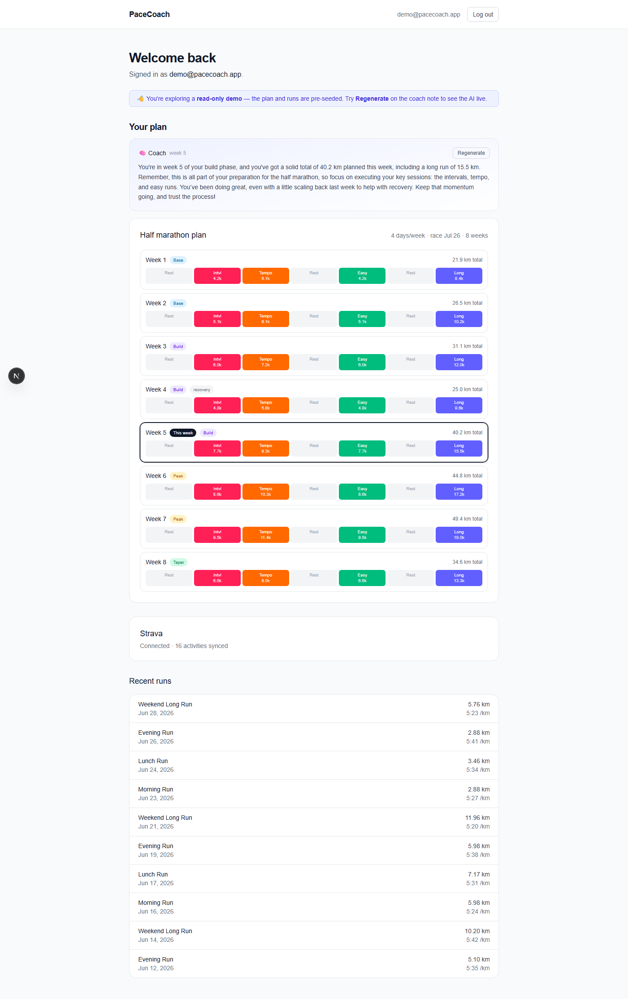

# PaceCoach

**Adaptive running training plans that adjust to how you actually run.** PaceCoach
syncs your Strava runs, generates a periodized plan for your goal race, adapts each
upcoming week to your real performance, and uses an LLM to explain — in plain
language — *why* the plan changed.

> 🔗 **Live demo:** <!-- LIVE_URL --> _(add after deploy)_ — click **"Try the demo"**
> for a fully populated account, no signup required.



---

## Why it's interesting

Most training apps are CRUD around a static plan. PaceCoach's core is two
**deterministic, unit-tested algorithms** with an LLM layer bolted on top for
explanation only — never for computing the numbers:

- **Plan generation** (`src/lib/plan/generatePlan.ts`) — turns
  `{ goalType, goalDate, daysPerWeek, fitness }` into a periodized plan
  (base → build → peak → taper), with recovery weeks every 4th week, a progressive
  long run capped at a fraction of goal distance, and one long run + rest day per
  week. Same input → same output (UTC date math, no `Date.now()`), so it's fully
  testable.
- **Adaptive algorithm** (`src/lib/plan/adaptPlan.ts`) — matches your actual runs to
  each planned week, computes a volume ratio, and classifies the week as
  **scale up / hold / scale down**, then rescales the *upcoming* weeks while leaving
  history untouched.
- **AI coach** (`src/lib/ai/`) — receives the **pre-computed facts** (phase, this
  week's workouts, recent-run summary, the adaptation the engine decided) and returns
  a 2–4 sentence coaching note. It narrates the data; it never invents distances,
  paces, or the plan. Server-side only, cached per week, with a deterministic fallback
  if the API is unavailable.

The plan/adaptive engines are covered by **38 unit tests** (`npm test`).

## Stack

Next.js 16 (App Router, TypeScript, `src/`) · Tailwind CSS · Supabase (auth +
Postgres, RLS on every table) · Strava API (OAuth + activity sync) · OpenAI
(`gpt-4o-mini`, server-side) · Vercel · Vitest.

## How it works (architecture)

- **Auth** — Supabase email/password with cookie-based SSR sessions
  (`@supabase/ssr`) and middleware route protection for `/dashboard`.
- **Strava** — real OAuth (`state`-guarded), automatic token refresh + rotation,
  manual "Sync now" that normalizes runs into an `activities` table. Client secret and
  token writes are server-side (service-role) only.
- **Data model** — 6 tables (`profiles`, `strava_accounts`, `activities`, `plans`,
  `weeks`, `workouts`), `user_id` denormalized for simple RLS (`user_id = auth.uid()`),
  a signup trigger that auto-creates a profile, and generated TypeScript types.
- **Demo mode** — a shared, read-only demo account seeded with a mid-stream plan and
  aligned "actual" runs (the last completed week is deliberately under-target, so the
  adaptive engine produces a real *scale-down* the coach then explains). Seeded via a
  secret-guarded, idempotent route (`POST /api/demo/seed`).

## Local development

```bash
npm install
cp .env.example .env.local   # fill in the values (see below)
npm run dev                  # http://localhost:3000
```

Quality gates:

```bash
npm run typecheck
npm run lint
npm test        # 38 unit tests
npm run build
```

### Environment variables

See `.env.example` for the full list. Required:

| Variable | Purpose |
|----------|---------|
| `NEXT_PUBLIC_SUPABASE_URL`, `NEXT_PUBLIC_SUPABASE_ANON_KEY` | Supabase client |
| `SUPABASE_SERVICE_ROLE_KEY` | Server-side privileged writes (never client-side) |
| `STRAVA_CLIENT_ID`, `STRAVA_CLIENT_SECRET`, `STRAVA_REDIRECT_URI` | Strava OAuth |
| `OPENAI_API_KEY` (+ optional `OPENAI_MODEL`) | AI coach (server-side only) |
| `NEXT_PUBLIC_SITE_URL` | App base URL |
| `DEMO_EMAIL`, `DEMO_PASSWORD`, `DEMO_SEED_SECRET` | Demo account + seed-route guard |

### Seeding the demo

```bash
curl -X POST "$NEXT_PUBLIC_SITE_URL/api/demo/seed" -H "x-seed-secret: $DEMO_SEED_SECRET"
```

Idempotent — safe to re-run to reset the demo account.

## Project layout

```
src/
  app/            # routes: landing, (auth), dashboard, plan/new, api/{strava,demo}
  lib/
    plan/         # generatePlan + adaptPlan (pure, unit-tested) + persistence
    ai/           # coach (OpenAI, server-only) + coachInput data bridge
    strava/       # OAuth, token refresh, activity sync
    supabase/     # browser/server/admin clients + generated types
    demo/         # demo config + deterministic seed builder
```
